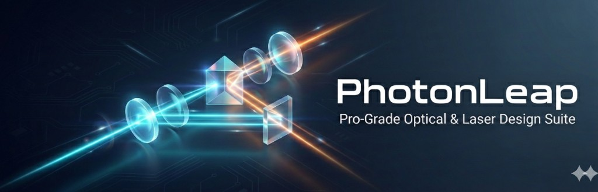
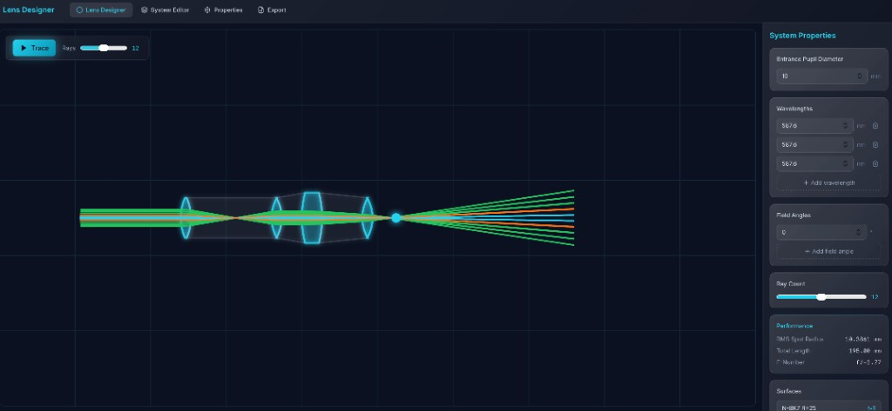

<div align="center">

[](https://m4gr4th34.github.io/MacOpticsApp/)

**No installation required · Works in all modern browsers** (Chrome, Firefox, Safari, Edge)

<br />

  <a href="https://m4gr4th34.github.io/MacOpticsApp/">
    
  </a>
  <br /><br />
  <a href="https://m4gr4th34.github.io/MacOpticsApp/" style="display: inline-block; background: linear-gradient(135deg, #22D3EE 0%, #6366F1 100%); color: white; font-weight: bold; font-family: -apple-system, BlinkMacSystemFont, 'Segoe UI', Roboto, sans-serif; text-decoration: none; border-radius: 12px; padding: 16px 32px; margin: 20px 0; font-size: 1.1em; box-shadow: 0 4px 14px rgba(34, 211, 238, 0.4);">
    🚀 Open Live Demo
  </a>
  <br /><br /><br />
</div>

<br /><br />

# MacOptics — Optical Ray Tracing

**MacOptics v2.0: The Zero-Install Revolution. Physics at the Edge.**

Open-source, license-free optical design software. Design singlet lenses, run ray traces, and visualize performance metrics—with or without a backend. The Python physics engine now runs **directly in your browser** via Pyodide (WebAssembly).



---

## Tech Stack


**Platform Support** — Dynamic Alt / ⌥ Option key labels for Override Snap-to-Focus; adapts to Windows and macOS.

---

## Zero-Install (Pyodide) Mode

MacOptics supports a **zero-install** architecture: the Python physics engine runs in the browser via Pyodide (WebAssembly). No backend server required.

> 📄 **See [RELEASE_NOTES.md](RELEASE_NOTES.md)** for the full v2.0 announcement—*The Photon Leap*.

| Mode | Build | Trace Engine |
|------|-------|--------------|
| **Standard** | `npm run build` | HTTP backend (FastAPI) |
| **Standalone** | `npm run build:standalone` | In-browser Pyodide worker |

**Standalone build** produces a self-contained `dist/` folder suitable for ZIP distribution:

```bash
cd web-app && npm run build:standalone
# Optional: create ZIP
npm run build:zip
```

Open `dist/index.html` in a browser (or serve via `npx vite preview`). The Pyodide worker loads Python + NumPy from CDN and executes ray-trace logic locally. **Lens-X import/export** works seamlessly—all parsing is client-side.

> **Note:** Some browsers restrict Web Workers when opening `file://` directly. For best results, serve the `dist/` folder over HTTP (e.g. `npx serve dist` or `python -m http.server` in `dist/`).

**GitHub Pages:** The [deploy workflow](.github/workflows/deploy.yml) builds on push to `main` and deploys to the `gh-pages` branch. Enable Pages in repo Settings → Pages → Source: `gh-pages` branch. Live at `https://<user>.github.io/<repo>/`.

---

## 🛠️ For Developers

**Help us push the boundaries of browser-based optical engineering.** MacOptics uses a hybrid React–Pyodide architecture: the Python physics engine runs in a Web Worker and communicates with the UI via `postMessage`. New contributors should read **[CONTRIBUTING.md](CONTRIBUTING.md)** for the "Neural Link" architecture, file map (Brain/Nerves/Body), and guidelines for Python changes, type safety, and testing.

### Development Workflow (Pyodide Mode)

```bash
cd web-app
VITE_USE_PYODIDE=true npm run dev
```

Open **http://localhost:5173**. The Pyodide worker loads from the dev server; trace runs entirely in-browser. For standalone builds:

```bash
cd web-app
npm run build:standalone
npx serve dist
```

---

## Project Goals

- Deliver a modern, free optical design tool for students, researchers, and small teams
- Bridge laser and ultrafast optics (Gaussian beams, dispersion) with manufacturing-grade reliability analysis
- Provide a clean workflow from design through trace to ISO 10110 export—without vendor lock-in

---

## 🚀 Powered by Lens-X

MacOptics uses **Lens-X**, a physics-aware optical interchange format that goes beyond legacy ISO 10110 flat drawings. Instead of a static blueprint, Lens-X embeds geometry, glass chemistry (Sellmeier), coating data, and manufacturing tolerances in a single JSON file—enabling a true **Digital Twin** of your optical system.

| Aspect | Legacy ISO 10110 | Lens-X (Digital Twin) |
|--------|------------------|------------------------|
| **Output** | Flat 2D drawing (SVG/PDF) | JSON + optional drawing |
| **Geometry** | Cross-section only | Radius, thickness, aperture (mm) |
| **Glass** | Material name only | Sellmeier coefficients for n(λ) |
| **Coatings** | Not specified | MgF₂, BBAR, V-Coat, mirrors, HR |
| **Tolerances** | S/D, R±, T± in drawing | Structured in `manufacturing` |
| **Reusability** | Manual re-entry | Import → trace → export round-trip |
| **Simulation** | Requires separate tools | Same file drives ray trace |

Export your design as Lens-X JSON to share a complete, executable specification. Import Lens-X files to restore geometry, materials, and coatings without re-typing. See `LENS_X_SPEC.md` for the schema.

---

## 🌈 Coating Lab & Spectral Analysis

The **Coating Lab** is a professional-grade suite for managing thin-film performance.

**Features**

- **Pre-populated catalog** — 50+ coatings across AR, HR, metallic mirrors, beamsplitters, and dichroics (V-Coat, BBAR, Protected Silver/Gold/Aluminum, notch filters)
- **Custom wizard** — Define user coatings from CSV spectral data; constant R or wavelength-dependent R(λ) tables
- **Live graphing** — R(λ) curves visualized in the coating dropdown; reflectivity at primary wavelength
- **Ray-trace integration** — Power loss per surface: I_new = I_old × (1 − R); HR coatings follow reflected ray
- **Full portability** — Custom R(λ) tables embedded in Lens-X export; projects work on any machine without local coating library

| Capability | Standard (Catalog) | Custom (Wizard) |
|------------|-------------------|-----------------|
| **Source** | Built-in library | CSV upload, constant R |
| **R(λ)** | Analytic formulas | Table interpolation |
| **Lens-X export** | Coating name only | Full R(λ) table serialized |
| **Use case** | Quick design, common coatings | Measured data, proprietary specs |

**Engineering impact** — The Coating Lab allows designers to move beyond geometric optics and account for energy loss and spectral filtering, essential for high-power laser and multi-spectral sensor design.

---

## 🚀 Getting Started

### How to Run

| User Type | Steps |
|-----------|-------|
| **Non-tech** | 1. Download `macoptics-standalone.zip`<br>2. Extract the folder<br>3. Run **`start-mac.command`** (Mac) or **`start-windows.bat`** (Windows)<br>4. Browser opens at http://localhost:8080 — no extra install needed (uses built-in Python) |
| **Zero-install (standalone)** | 1. `cd web-app && npm run build:standalone`<br>2. `cd dist && npx serve .` or `python -m http.server`<br>3. Open the URL (e.g. `http://localhost:3000`) |
| **Full stack (backend + frontend)** | 1. Backend: `uvicorn backend.main:app --reload --port 8000`<br>2. Frontend: `cd web-app && npm run dev`<br>3. Open **http://localhost:5173** |

### Key Benefits

- **One-click launch** — Run `start-mac.command` or `start-windows.bat`; uses Python’s built-in server (no npm, no pip).
- **Air-gapped privacy** — Optical designs never leave your machine; calculations happen in RAM.
- **Instant interaction** — Zero network latency for ray-tracing and Monte Carlo simulations.

### Installation (Full Stack)

**Backend (FastAPI / Python)**

```bash
python3 -m venv venv
source venv/bin/activate   # Windows: venv\Scripts\activate
pip install -r requirements.txt
```

**Frontend (Vite / React)**

```bash
cd web-app
npm install
```

### Quick Start (Full Stack)

Run both services in two terminal windows:

```bash
# Terminal 1 — Backend
uvicorn backend.main:app --reload --host 0.0.0.0 --port 8000
```

```bash
# Terminal 2 — Frontend
cd web-app && npm run dev
```

Then open **http://localhost:5173**

---

## Killer Features

Once you're up and running, here's what you get:

- **High-precision ray tracing** — Sequential ray optics via rayoptics; spot diagrams, RMS radius, and focus metrics at the image plane
- **Real-time SVG viewport** — Interactive cross-section with zoom, pan, and through-focus scan line; dynamic optical_stack management
- **Gaussian beam propagation** — Beam waist (w₀), Rayleigh range (z_R), M² analysis; ABCD matrix envelope visualization
- **Femtosecond dispersion** — GDD/TOD in the Ultrafast HUD; thermal lensing heat map for high-power CW
- **Monte Carlo reliability** — Tolerance jitter (R±, T±, Tilt±); point cloud yield map; sensitivity heatmap in System Editor
- **ISO 10110 export** — Cross-section, dimension lines (CT), data table (Surf, S/D, Material), title block; SVG and PDF
- **Magnetic snapping** — Scan line snaps to best focus and surface boundaries; Space+Drag pan; platform-aware Alt/⌥ keybindings

---

## Architecture

```
MacOpticsApp/
├── backend/                 # FastAPI Python backend
│   ├── main.py              # API routes, CORS, request models
│   ├── trace_service.py     # Ray-tracing logic (rayoptics)
│   └── singlet_rayoptics.py # Optical model building
├── web-app/                 # React + Vite frontend
│   └── src/
│       ├── components/      # UI components
│       ├── api/             # Trace API client
│       ├── types/           # TypeScript types
│       ├── lib/             # Materials, config
│       └── config.ts        # App settings
├── tests/                   # Pytest integration tests
├── requirements.txt         # Python dependencies
└── README_API.md            # API reference
```

### Frontend (React + Vite)

- **Lens Designer** — Canvas with optical viewport; add/edit/reorder surfaces, run trace
- **System Editor** — Table of surfaces (radius, thickness, material, diameter)
- **System Properties** — Entrance pupil, wavelengths, field angles, ray count
- **State** — Single source of truth in `App.tsx`; surfaces identified by unique `id`

### Backend (FastAPI)

- **POST /api/trace** — Accepts `optical_stack` JSON, runs rayoptics, returns rays and surface curves as `(z, y)` coordinates
- **GET /api/health** — Health check
- Uses `rayoptics` for sequential ray tracing and spot diagrams

### Data Flow

1. User edits surfaces in React → state updates
2. User clicks **Trace** → frontend sends `optical_stack` to `/api/trace`
3. Backend builds optical model, traces rays, returns `{ rays, surfaces, focusZ, performance }`
4. Frontend renders rays and lens profiles in SVG viewport

## Configuration

- **API URL** — Set `VITE_API_URL` (default: `http://localhost:8000`) or edit `web-app/src/config.ts`
- **Viewport / ray defaults** — See `web-app/src/config.ts`

## Tests

```bash
pytest tests/ -v
```

## API Details

See [README_API.md](README_API.md) for endpoint specs and response format.

---

## 🤝 Contributors Welcome

- **Pythonistas** — Optimize the browser-native trace engine in `web-app/public/pyodide/trace.py`.
- **Frontend engineers** — Refine the **Neural Link** (Web Worker bridge) in `web-app/src/lib/pythonBridge.ts`.
- **Lens-X** — The interchange standard holds the ecosystem together; see `LENS_X_SPEC.md`.
